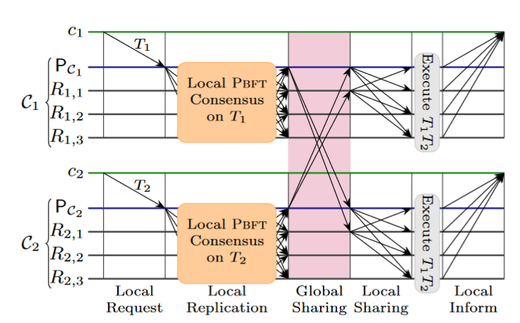

 ## My_PBFT

实现功能：以地理位置来进行分成不同集群，每个集群独立进行PBFT共识，同时每个集群内通过信誉积分选择最值得相信的节点作为当前集群的代表节点（主节点），所有代表节点形成一个上层的委员会，来实现共享本地集群内的共识以实现全局共享，每个代表节点在收到其他集群的提案后会共享给本地集群内的成员。

存在三种实体：客户端、主节点、成员节点。

可以将对主节点的监控分为链上和链下两种，委员会成员验证和离线验证！

#### [2024-3-9] 

为每个节点增加公私钥对,用于共识时节点信息验证! 主要在节点开始时生成公私钥对，
每次发送信息时要用私钥加密，验证收到信息时要通过公钥验证，验证通过才同意。

#### [2024-3-11] 

rsa修改完成，现在每次只能发送一次信息，也就是说完成一次共识之后的状态没有回调，
同时每次完成commit之后没有清空缓存，预计一天修改完成后开始设计分组共识。

每次一个节点正确执行完成任务之后也有可能因为网络问题没有正常返回reply信息，
需要给他们留有这种容错。

PBFT 基本共识实现完成（除了 viewchange ），准备分集群测试。

#### [2024-3-12]

先分三组，每组固定一个主节点PC，当主节点收到请求时先达成组内共识，在commit结束后，
主节点将组内共识分别共享给另外两组内f + 1个节点。
需求： 
* 本地共识结束之后，节点先不要执行任务，主节点将组内共识分别共享给另外两组内f + 1个节点。
需要发送的消息m = {cluster,nodeLD,committedMsg,sign}
* 需要为每个节点开一个新的goroutine，用于处理全局的消息。
* 需要一个新的http 路由 ./global 关联处理函数server.getglobal，
当这个函数收到其他组主节点发送的消息，就会将这个消息广播给组内其他成员
* 在本地收到2f个全局共享共识的确认后将该共识动作放到缓存池中，等待所有动作的顺序执行。

已经完成第一次全局消息的分发，明天来修改reply函数，更改为顺序执行；（在geobft中 ，
最后的排序和执行任务阶段是顺序执行，这样才能保证区块的一致性）。

#### [2024-3-13]

**！！！原来的PBFT还有问题，当请求很多很快的时候，有的节点如果慢了（比如此时其他三个节点已经
完成viewID 20 的执行和reply，它还在viewID 19 的共识等待commit或者prepare，这时候就会
造成系统死锁**
这个问题晚点来解决。

待修改：
* “在 GeoBFT 中，我们使用的 Pbft 实现只对客户端请求和提交消息
使用数字签名，因为只有这些消息需要转发” 修改数字签名的使用方式
* 要保证最后的节点发送给主节点的committed消息一定能收到
* “为了在通信可靠且延迟有界的情况下保证终止，Pbft 使用视图变化和检查点。"
视图变化就是本地viewchange，这个晚点实现，检查点是保证非故障节点能够从故障和恶意行为中恢复
* 注意修改成上图的Local Sharing！
* 当集群 C 在某一轮中没有客户请求可执行时，主 PC 可以提出一个不执行请求（no-op-request）。
当主 PC 开始从其他群集接收第 ρ 轮的客户请求时，它就能检测到第ρ 轮是否需要这样的无操作请求。这种不操作请求也需要通过本地复制获得提交证书。

#### [2024-3-16]

要改好几个点：

1. 本地请求达成本地共识后，应该存在一个缓存里，GlobalLog.MsgLogs这个缓存改成只需要存储一个集群的共识就行，那这个缓存需要一个锁
2. 一个集群的所有节点在收到全局共识的消息后就执行全局共识，并将该共识存入committedMsg中
3. 每个集群的主节点在完成全局共识后要检查下一个发送全局共识消息的主代理人是不是自己，如果是自己还要检查是否有共识

#### [2024-3-25]

**现在程序基本已经没问题了，实现了分组实现 PBFT 共识，然后由主节点共享给其他主节点，其他主节点
再在本地达成共识最后得到全局共识。**

##### 接下来的工作：

* 先加入信誉分数的数据结构，Node 结构里面需要有 ReScore 这个记录全局节点的分数的数据结构，因为要存储很多节点，
  所以每个节点的score定义为uint8，分值为(0-100)，这个 ReScore 的结构应该和 NodeTable 差不多。
* 定义信誉分数更新的机制。1.

1. 每个节点在本地共识的prepare阶段，在收到2f + 1 条 prepare 消息之后就可以广播一条 COMMIT 消息，
   其中包含相关区块的标识，并列出收到的 PREPARE 消息的发送者。该信息用于调整验证者的奖励积分。
2. 达成本地共识后，主节点也要将本地的信誉分数广播给其他集群主节点来达成全局共识以调整信誉分值。
3. 同时在每一次轮到当前主节点作为主代理节点时，将上一次本地共识得到的本地节点的得分分享给本地节点，使本地全局节点达成分数共识。
4. 主节点对于某个节点的信誉分数的调整是依据于：Commit阶段收到的节点的赞成消息和节点消息中收到的其他节点的赞成消息。

* 整理一下，子节点信誉更新：首先在prepare阶段收到其他节点的赞成或反对票，在收到2f+1个prepare消息后，本地调整收到的节点的信誉，然后将该信息加入
  commit共识消息中共享给其他节点，其他节点在收到commit消息之后也会根据收到的commit消息里面的节点的赞成消息调整信誉。
  那看样子不用主节点再专门广播一次来达成全局消息的共识了？
* 在子集群中根据信誉划分委员会节点和非委员会节点，委员会节点参与共识的全过程，非委员节点只接受prepare和commit消息而不对其投票，只是被动链接区块！
* 信誉分数应由：共识信誉 + 交易信誉结合而成，这样非委员会节点可以在交易过程中提高自己的信誉而被选拔为委员会节点来参加主共识过程。

#### [2024-3-26]
**今天任务：**
* 加入信誉机制以及分委员会节点。节点在初始化时要有一个参数判断为Committee_nodes还是NonCommitteeNodes
* 对于CommitteeNodes在保留原来功能的基础上，增加信誉分数更新机制：在Prepare阶段，收到其他节点的投票都存储，在prepare阶段结束时将其加入广播消息中广播给其他节点。
在Commit阶段，收到其他节点的消息，同时根据该消息中所有节点的投票情况，更新当前节点的信誉分值视图。
* NonCommitteeNode在所有阶段都不会广播消息，只是被动接受消息，但同样也有Preprepare、Prepare和Commit阶段，接受的都是委员会节点的消息。

#### [2024-3-28]
基本对比实现完成，思考一下怎么设计总的方案：
节点共识成功和失败的分值怎么计算，对于恶意节点的部分还完全没有设计。

N 节点在共识过程中失败的行为可能是：1.其他节点没有收到 N 的共识消息 2.N 节点相对于 2f+1 的节点投了反对票。 其中第一点
无法判断是网络问题还是 N 节点就是恶意节点，第二种就可以判断其为恶意节点。所以第一种情况的扣分可以少一点或者连续多次不投票才扣分，第二种
情况就可以扣打分。

共识节点的信誉基于每次共识的动作和历史的信誉值来计算。

###### 下面的想法是以后再用的
_节点的分数分为：共识信誉 * 0.5 +交易信誉 * 0.5，所以还要存储历史信誉值，参与共识的节点的分值是由总信誉分决定的，这样可以保证即使没有参加共识的节点，在
长时间的正确交易的情况下其依然有资格参与共识。
交易信誉和共识信誉都有上限，达到上线之后就不会再增加，交易过程中对于双方交易的撮合的排序需要依靠与节点的交易信誉值，
共识信誉达到上限溢出之后会转换为奖励（设置发行的某种币种）_

#### [2024-4-1]
node.go 的 getCommit中使用了CommitteeNodeNumber，后期要将其换为活跃的委员会节点的集合

#### [2024-4-25]
已经新增内容：1.主节点将收到的req用一个协程发送给其他本地节点 2.增加客户端节点代码 3.主节点在共享全局共识消息时要将本地的同意的节点签名打包发送，其他主节点收到后要验证这些签名。

这些内容后面要同步到另外两个项目中。

今天需要新增功能：viewchange和主节点轮询，为每个执行的request加上一个timer

#### [2024-4-28]
为每个 goroutine 加上一个		time.Sleep(50 * time.Microsecond) 以减少CPU占用

